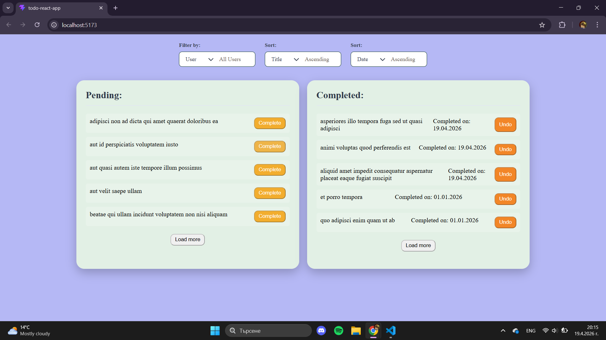

# Todo React App

A full-featured todo application built with React that allows users to manage tasks, filter by user, sort by title or completion date, and includes pagination with completion date tracking.

---

## Author

- [**Teodora Balabanova**](https://github.com/theteddyb)
- _Second-year Cybersecurity student @ TU-Sofia Bulgaria_

### My Learning Journey

This is my first React project. During the timeframe given for realizing it, I had the opportunity to work my way through unfamiliar concepts, learn the basics, and figure out ways to implement various key React features. As I went along with the process, I took my work a step further by paying additional attention to finding a way to include comfortable design, expanding the learning spree on frontend grounds accordingly. In retrospect, this project was a great opportunity to test my ability to adapt and learn on the go. Although I did not manage to fulfill all of the ideas I had for this work in mind, I'm content with the outcome nonetheless.

---

## Screenshot



---

## Features

- **Two-column layout** – Uncompleted todos on the left, Completed todos on the right.
- **Complete / Undo buttons** – Move todos between columns with automatic completion date tracking.
- **Custom dropdowns** – Styled dropdown menus with chevron icons.
- **Filter by user** – Dynamic dropdown showing real usernames fetched from an API.
- **Sort by title** – Alphabetical sorting (Ascending / Descending) for uncompleted todos.
- **Sort by date** – Chronological sorting for completed todos (oldest/newest first).
- **Load More pagination** – Shows 5 items at a time with a "Load More" button for each column.
- **Completion dates** – Automatically recorded when a todo is marked as complete.

---

## Built With

- **React** – UI library
- **Vite** – Build tool and development server
- **FontAwesome** – Icons for custom dropdown chevrons
- **CSS** – Custom styling

---

## Prerequisites

Before you begin, ensure you have the following installed:

- **Node.js** (v18 or higher) – [Download here](https://nodejs.org/)
- **npm** (comes with Node.js)

To check your versions:

```bash
node --version
npm --version
```

---

## Installation & Setup

Follow these steps to get the app running on your local machine.

1. **Clone the repository**

```bash
git clone https://github.com/theteddyb/todo-react-app.git
cd todo-react-app
```

2. **Install dependencies**

```bash
npm install
```

3. **Install FontAwesome icons** (for dropdown chevrons)

```bash
npm install @fortawesome/react-fontawesome @fortawesome/free-solid-svg-icons @fortawesome/fontawesome-svg-core
```

4. **Run the app locally**

```bash
npm run dev
```

5. **Open the app**

Navigate to: [http://localhost:5173](http://localhost:5173)

---

# License

This project is for educational purposes as part of the Practicum Program of TU-Sofia Bulgaria for 2026 presented by DSS - Digital and Software Solutions ltd.
